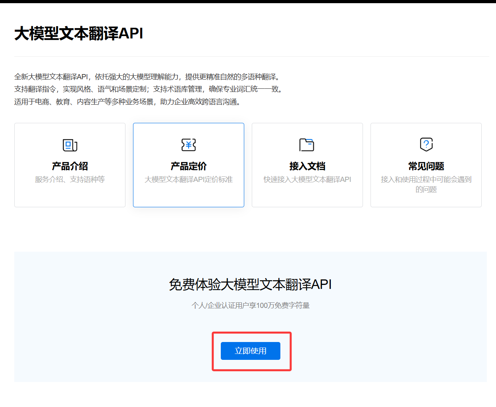
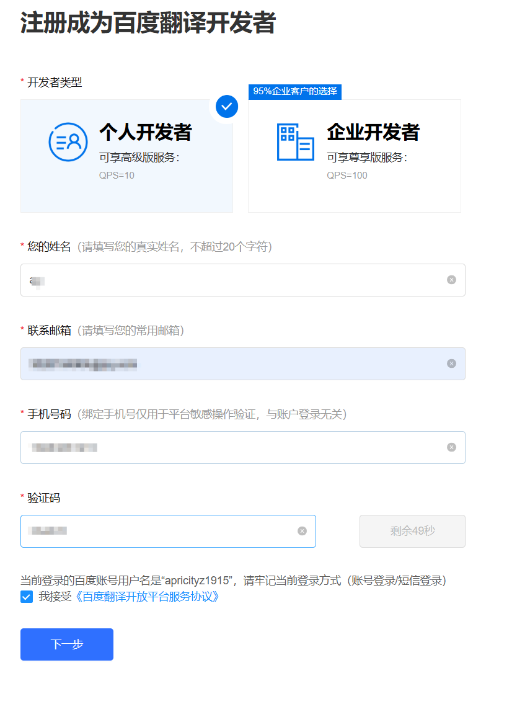
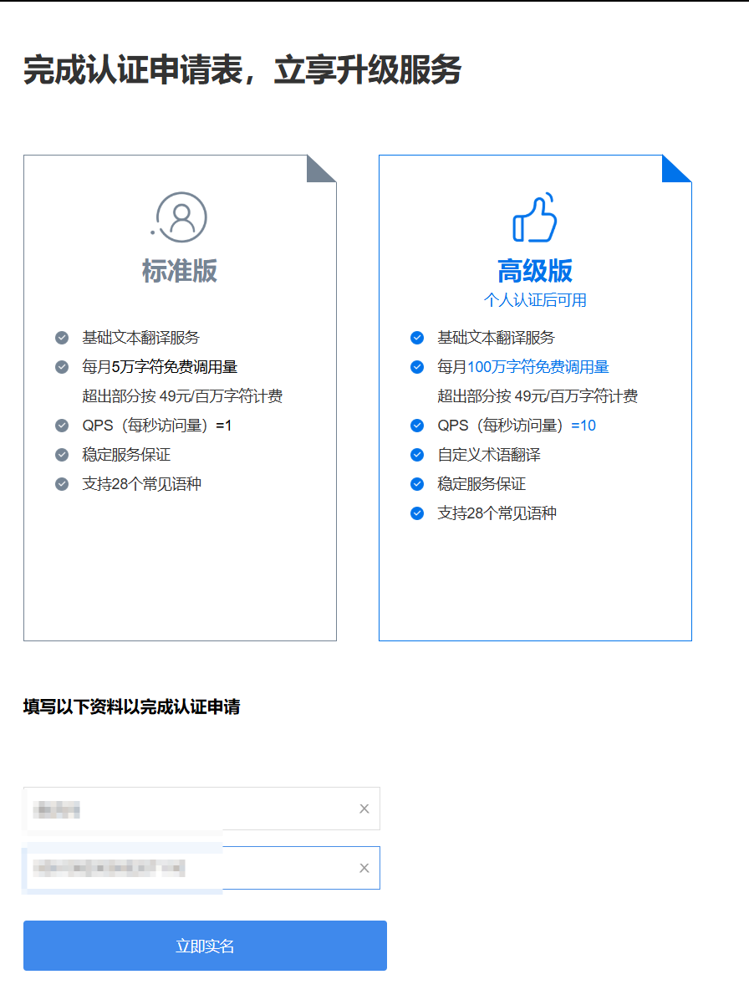
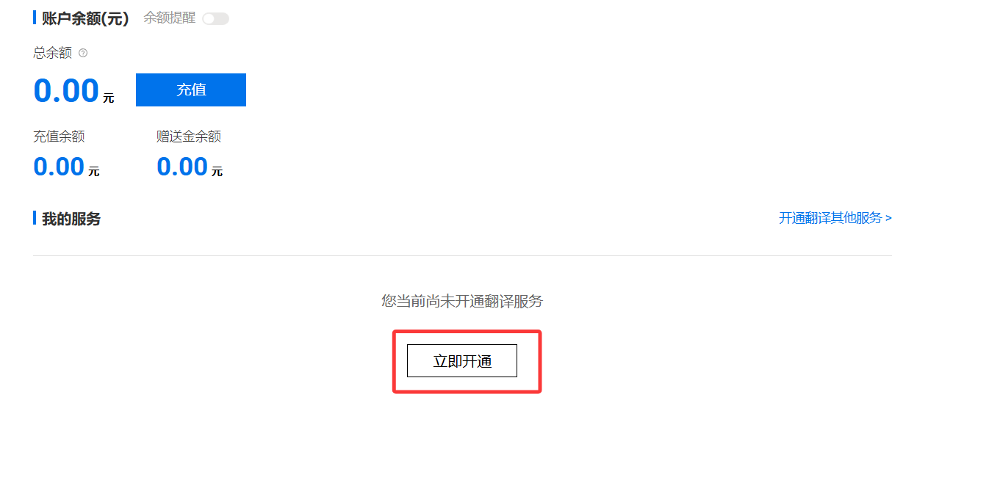
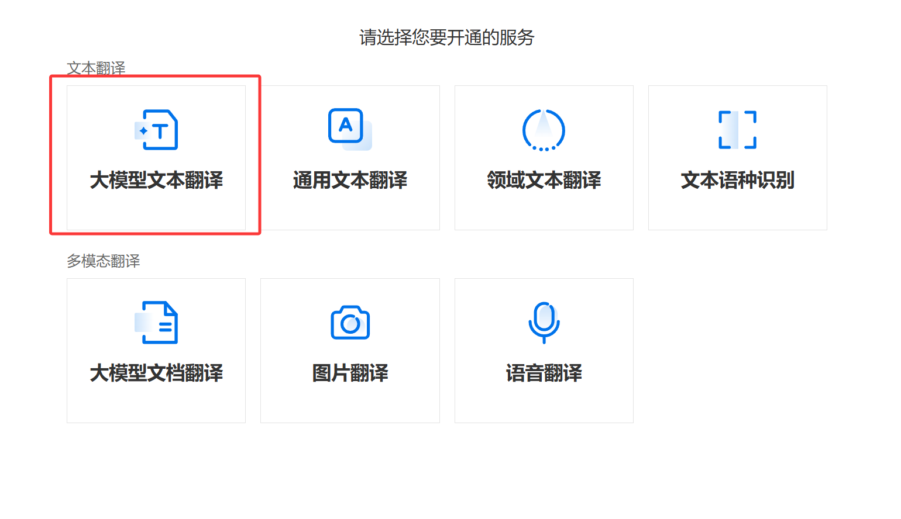
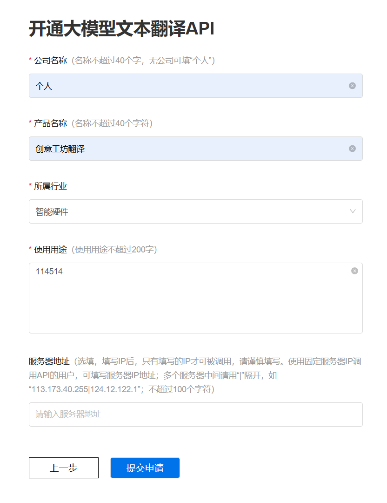
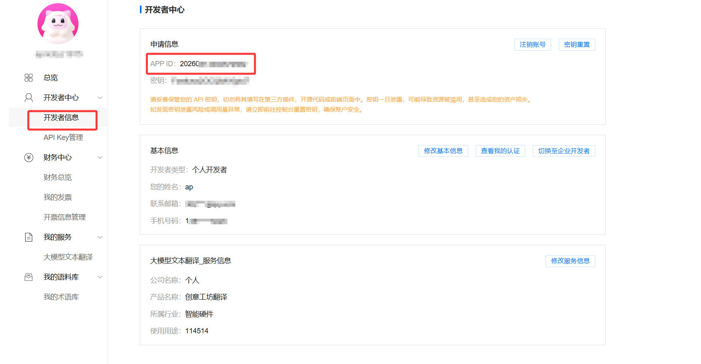
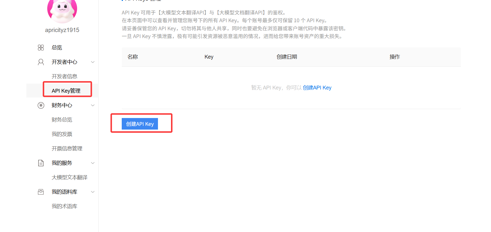
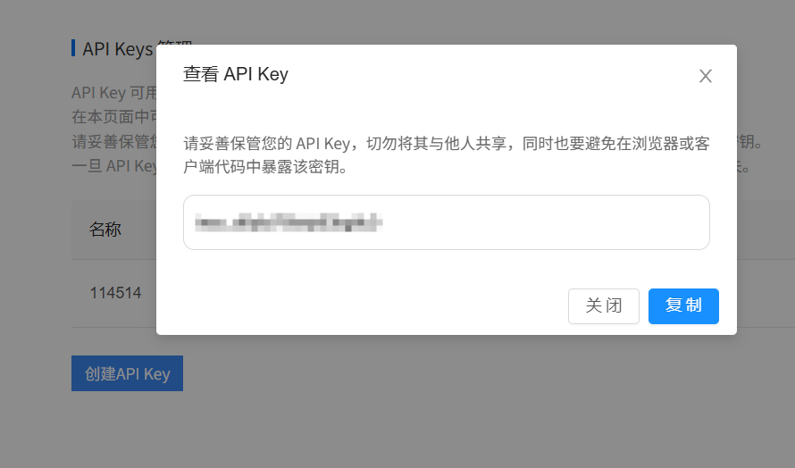

1. 进入百度翻译开放平台
https://fanyi-api.baidu.com/product/13
2. 点击立即使用
】
3. 根据提示填写个人信息

4. 进行实名认证

5. 认证完后会跳转到控制台，点击立即开通

6. 点击大模型文本翻译

7. 随便输点内容然后提交申请

8. 回到主界面点击开发者信息

9. 把 AppID 记下来
10. 点击 API Key 管理，创建 apikey，名称随便填

把这个apikey记下来

11. 在app中填入 appid 和 apikey 即可使用